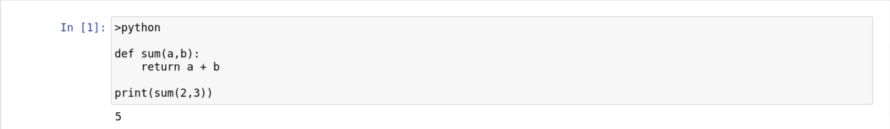
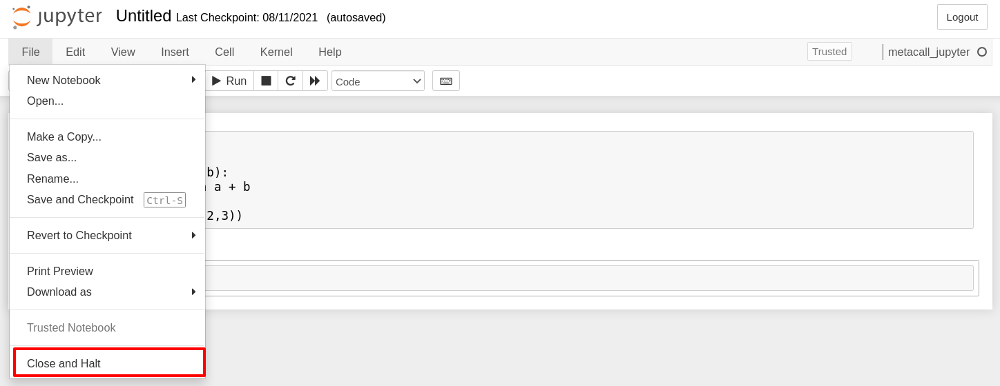
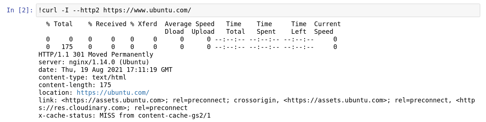
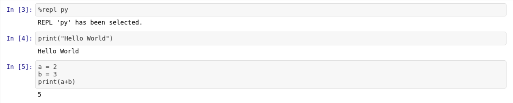
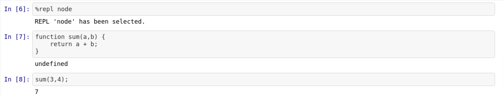
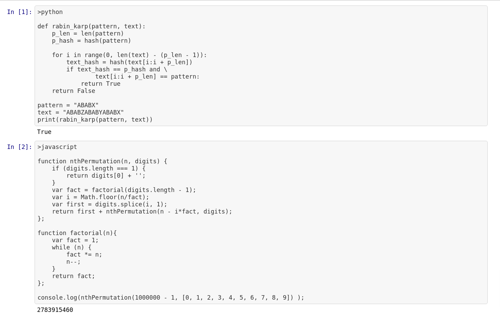
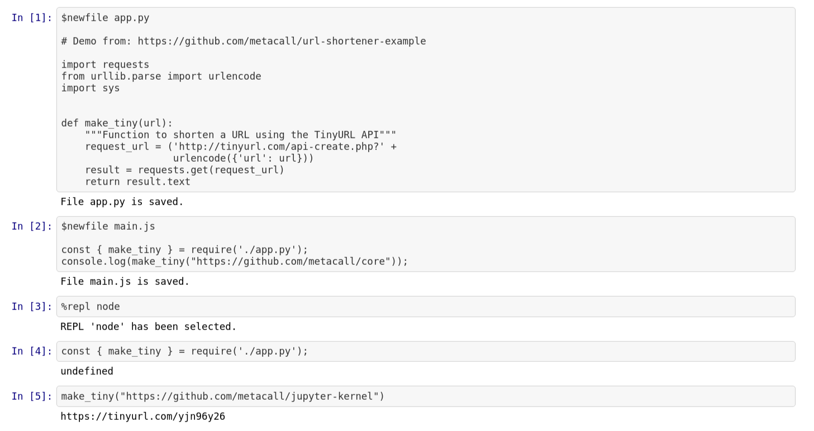
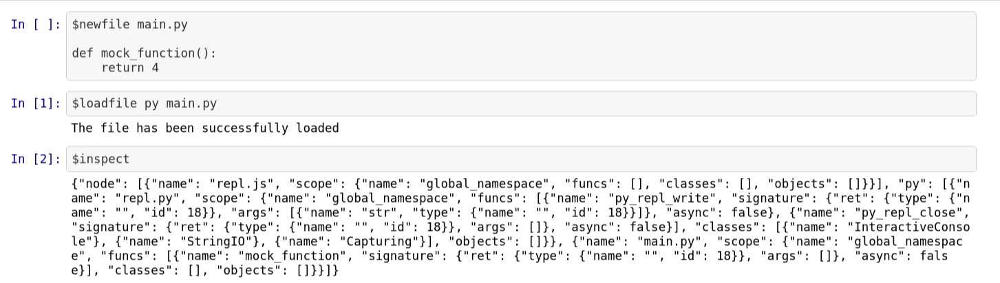
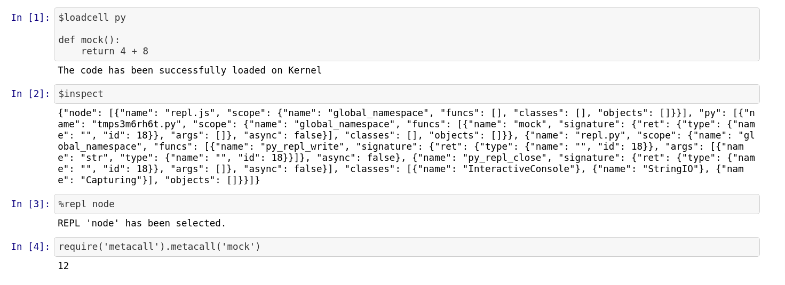

Usage
=====

Start the notebook server from the command line:

::

   jupyter notebook

You should see the notebook open in your browser.

Create a new notebook
---------------------

Chose the new ``metacall_kernel`` kernel by

::

       New -> metacall_kernel

The *console* window will show you kernel messages, especially it will
tell you when the notebook was saved (periodically).

Send input
----------

**Send Key**: ``Shift-Return``

You may enter single line code followed by a Shift-Return, i.e. hold
down the Shift key, then press the Return key.

There are a lot of features in Jupyter, e.g. running all cells or a
print preview (rendered HTML) which allows you to save the complete page
(including images, outputs and so on) by your browser.

Close and Halt
--------------

The notebook may be terminated by

::

       $shutdown

or from the menu (preferred)

::

       File -> Close and Halt

Shell access
------------

**prefix**: ``!``

To run a shell command (e.g. ``ls``), put a ``!`` in front of the
command. Note that ``!`` must be the first character in the cell,
otherwise it will not be interpreted as shell prefix character.

You can push in the following to test it out:

::

       !curl -I --http2 https://www.ubuntu.com/

Loading REPL
------------

**prefix**: ``%repl <tag>``

Under the hood, the MetaCall Jupyter Kernel interacts with the `Polyglot
REPL`_, a Read-Evaluate-Print-Loop (REPL) that allows us to interact
with REPLs of multiple languages using MetaCall.

You can load a REPL, by just passing ``%repl <tag>`` where you can
replace ``<tag>`` with the languages available. You can check-out the
available languages through the ``$available`` command.

You can load the REPL via passing in ``%repl <tag>`` where tag can be
replaced with either Python or Node. You can add support for more
languages (like Ruby, Java and more) through the `Polyglot REPL`_.

Let's load a Python REPL and execute some code.

Let's load a Node REPL and execute some code.

Executing scripts
-----------------

**prefix**: ``>lang``

You can execute standalone scripts in Python and JavaScript (Node) using
the MetaCall exec through the MetaCall Jupyter Kernel. It provides a
handy way for you to execute scripts, check output and validate your
polyglot applications, without needing to exploit cross-language
function calls.

You can execute standalone scripts through ``>lang`` where the available
languages are ``python``, ``javascript`` or any other language that is
supported by the MetaCall CLI.

.. _Polyglot REPL: https://github.com/metacall/polyglot-repl

Newfile magics
--------------

**prefix**: ``$newfile <filename>``

You can create new files that are saved on the local directory through
the MetaCall Kernel over the Jupyter Notebook interface. You can make
use of the functionality to save files on your disk, while creating
polyglot applications and implement load from files.

To make use of this functionality, you can make use of
``$newfile <filename>`` to create the file. If the file doesn't exist,
it will create a file and append the code mentioned below to the same.
If the file does exist, the code would be appended below the existing
code in the file.

Load and inspect
----------------

**prefix**: ``$loadfile <tag> <filename>`` **prefix**: ``$inspect``

Through the MetaCall Kernel, you can save code in form of a file over
the disk using the ``$newfile`` magic. Through the
``$loadfile <tag> <filename>`` functionality, you can load these
external files in form of functions over the MetaCall's meta-object
protocol.

Once loaded, you can import these functions in a different language,
thus implementing cross-language function calls. To check whether a
function has been loaded, you can use ``$inspect``

Loadcell
--------

**prefix**: ``$loadcell <tag>``

Through the MetaCall Kernel, you can save load functions through code
cell directly using the ``$loadcell <tag>`` functionality. Through this,
you don't have to specify the filename and the function is loaded
directly by saving it on a temporary file.

Once loaded, you can import these functions in a different language,
thus implementing cross-language function calls. To check whether a
function has been loaded, you can use ``$inspect``.

You can find all the Notebook examples `here`_.

.. _here: https://github.com/metacall/jupyter-kernel/tree/master/examples
